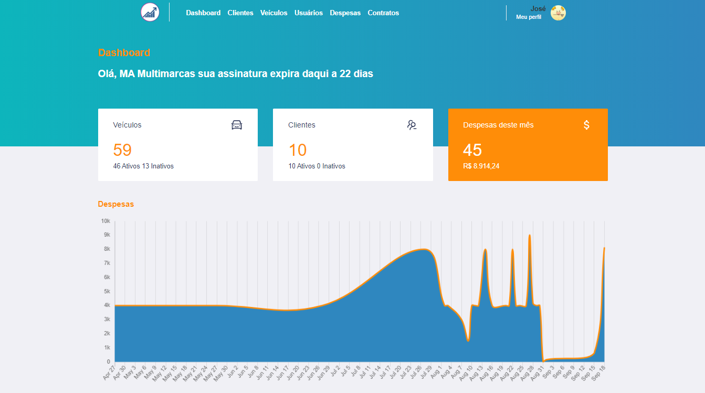

# Auto store


<h2 align="center">  
  <p align="center">
        
  </p>
</h2>

<h3 align="center">
  O projeto foi desenvolvido com a finalidade de gerenciar lojas automotivas
</h3>

  Funcionalidades:

  -  

### :heavy_check_mark: Configurações necessárias

-  [Git](https://git-scm.com)
-  [Node](https://nodejs.org/)
-  [Yarn](https://yarnpkg.com/)

### :arrow_down_small: Clonando o repositório
Pelo terminal, acesse o diretório em que deseja ter o repositório clonado e execute o comando a seguir.
```bash
# clonando o repositório
git clone https://github.com/davifrancamaciel/auto-store.git
```
### :computer: Iniciando o projeto


Pelo terminal, acesse o diretório auto-store/frontend do repositório clonado e execute os seguintes comandos separadamente para executar a aplicação (frontend).
Obs antes de rodar os comandos abaixo copie e cole o arquivo .env.example remomei o mesmo para somente .env e adicione as configurações de sua preferência
```bash
# instalando as dependências
yarn install

# iniciando a aplicação
yarn start
```

Pelo terminal, acesse o diretório auto-store/backend do repositório clonado e execute os seguintes comandos separadamente para executar a API (backend). 
Obs antes de rodar os comandos abaixo copie e cole o arquivo .env.example remomei o mesmo para somente .env e adicione as configurações de sua preferência
```bash
# instalando as dependências
yarn install

# criando as tabelas no banco de dados
yarn migrate

# inserindo dados default nas tabelas criadas no banco de dados
yarn seeds

# iniciando a api
yarn dev
```


### :wrench: Tecnologias | Ferramentas | Recursos

-  [ReactJS](https://pt-br.reactjs.org/)
-  [React App](https://pt-br.reactjs.org/docs/create-a-new-react-app.html)
-  [ReactDOM](https://pt-br.reactjs.org/docs/react-dom.html)
-  [React Router DOM](https://www.npmjs.com/package/react-router-dom)
-  [React](https://pt-br.reactjs.org/)
-  [React Toastify](https://github.com/fkhadra/react-toastify)
-  [Styled Components](https://styled-components.com/)
-  [Axios](https://github.com/axios/axios)
-  [React Redux](https://react-redux.js.org/)
-  [Redux](https://redux.js.org/)
-  [Redux Saga](https://redux-saga.js.org/)
-  [Docker](https://www.docker.com/)
-  [PostgreSQL](https://www.postgresql.org/)


